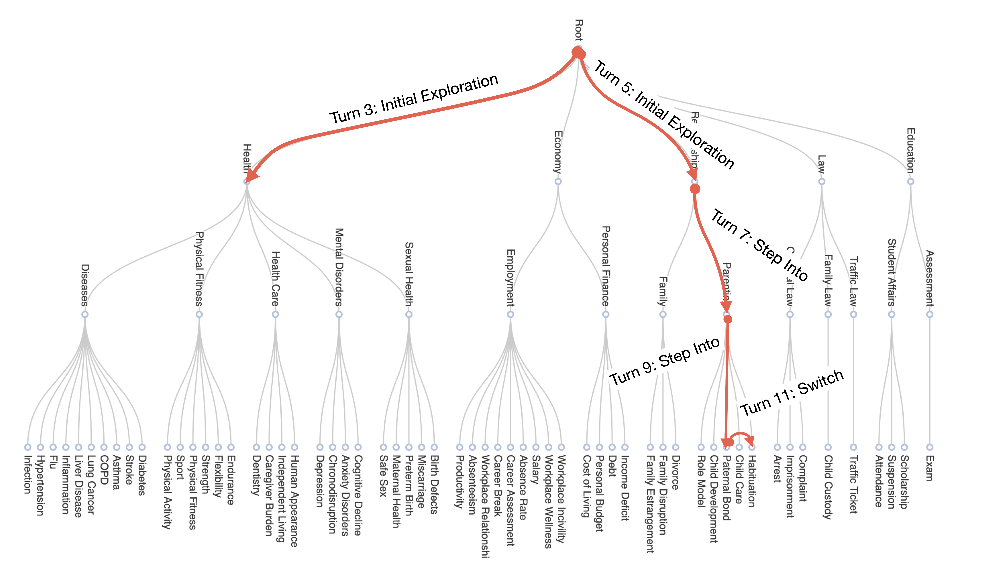
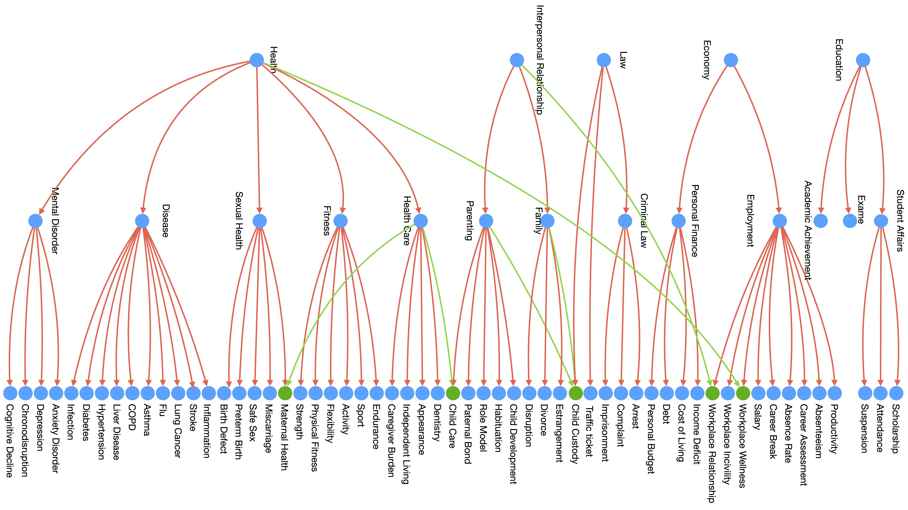

# CAMI: A Counselor Agent Supporting Motivational Interviewing through State Inference and Topic Exploration
Official Implementation of Motivational Interviewing Counselor Agent for Paper [CAMI: A Counselor Agent Supporting Motivational Interviewing through State Inference and Topic Exploration](https://aclanthology.org/2025.acl-long.1024/).

## Introduction

**[CAMI: A Counselor Agent Supporting Motivational Interviewing through State Inference and Topic Exploration](https://aclanthology.org/2025.acl-long.1024/)** 
</br>
Yizhe Yang<sup>1</sup>,
Palakorn Achananuparp<sup>2</sup>,
Heyan Huang<sup>1</sup>,
Jing Jiang<sup>2</sup>,
Ee-Peng Lim<sup>2</sup>

<sup>1</sup> Beijing Institute of Technology, <sup>2</sup> Singapore Management University

> Conversational counselor agents have become essential tools for addressing the rising demand for scalable and accessible mental health support. This paper introduces CAMI, a novel automated counselor agent grounded in Motivational Interviewing (MI) -- a client-centered counseling approach designed to address ambivalence and facilitate behavior change. CAMI employs a novel STAR framework, consisting of client's state inference, motivation topic exploration, and response generation modules, leveraging large language models (LLMs). These components work together to evoke change talk, aligning with MI principles and improving counseling outcomes for clients from diverse backgrounds. We evaluate CAMI’s performance through both automated and manual evaluations, utilizing simulated clients to assess MI skill competency, client's state inference accuracy, topic exploration proficiency, and overall counseling success. Results show that CAMI not only outperforms several state-of-the-art methods but also shows more realistic counselor-like behavior. Additionally, our ablation study underscores the critical roles of state inference and topic exploration in achieving this performance.

## Quick Start

```zsh
export OPENAI_API_KEY=      # Your OpenAI API KEY
export OPENAI_BASE_URL=     # Your OpenAI BASE URL
python generate.py \
    # GPT model you want to use
    --model gpt-4o \
    # Retriever model you want to use
    --retriever_path BAAI/bge-reranker-v2-m3 \
    # Path to the profiles.jsonl file
    --profile_path ./annotations/profiles.jsonl \
    # Output directory to save the generated conversations
    --output_dir Output/ \
    # Number of rounds to run the simulation
    --round 5 \
    # Maximum number of turns of one agent for each conversation 
    --max_turns 25
```

## What's New

**[2024-10-17]** Enhance the state inference module through a few-shot approach.

**[2024-11-08]** Improve the Initial and Focus Exploration algorithms to enhance the exploration capabilities of the system.

**[2024-11-20]** Strengthen the Self-Refine method to refine responses, thereby increasing the accuracy of reflecting provided instructions.

**[2025-1-16]** Enhance the topic tree structure to represent it as a topic graph. Implement a retrieval-based approach for the client simulator to identify the most relevant topic at the present time.

## The STAR Framework

Our proposed STAR framework consists of four key modules that collaboratively mimic a counselor performing MI counseling, that is: (a) *<u>S</u>tate Inference*, which infers the current client's state based on the transtheoretical model of health behavior change. Based on the inferred client's state, the counselor may perform topic exploration before selecting a response strategy; (b) *<u>T</u>opic Exploration*, which explores a wide range of motivation topics in a topic tree to find the topic that may evoke change talk with the client; (c) *Strategy Selection*, also known as *<u>A</u>ction Selection*, which selects the appropriate strategy based on the current client's state, session context, and identified topic (if any); and (d) *<u>R</u>esponse Generation \& Ranking*, which generates a few candidate responses based on the selected strategies and selects the most appropriate response that is coherent with the current context and aligned with MI principles. In this study, we assume that the counselor is aware of the client's behavior problem before any counseling begins. For more details, please refer to our paper.


### Client’s State Inference

To define the client's states, we utilize the transtheoretical model of health behavior change~\citep{prochaska2005transtheoretical,prochaska2008initial}, consisting of five states: *Precontemplation*, *Contemplation*, *Preparation*, *Action*, and *Maintenance*. Our primary goal is to assist clients in reaching the Preparation state, so our counselor agent focuses on the first three states. In the Precontemplation state, the counselor focuses on building trust, establishing change goals, understanding the client's motivations, and addressing misconceptions before encouraging the client to change. In the Contemplation state, the counselor listens to the client and addresses incorrect beliefs. In the Preparation state, the counselor provides the necessary information and tools to guide the discussion. We also aim to equip the counselor with the ability to engage the client, to collaborate with the client to identify the motivating topic for change, and to soften the client's preference for the status quo. We thus prompt LLMs to infer the client's state based on the session context and state descriptions in a zero-shot manner. Our experiment results show that the state-of-the-art LLMs perform this state inference task with high accuracy.

### Topic Exploration

When the client is in the Precontemplation state, the counselor engages the client to develop rapport and cultivate change talk by supporting them in exploring topics that evoke motivation for behavior change. During the process, the counselor may explore different topics (e.g., smoking causing harm to family members, medication reducing cholesterol) also known as the motivation topics. To our knowledge, topic exploration has not been studied in previous counseling agent research as most methods ignore the importance of change talk exploration. 


#### Topic Tree Construction

We propose a three-level topic tree as an external knowledge base that facilitates the exploration of motivation topics by the counselor agent, aiming to evoke change talk for clients facing various behavioral challenges. As shown in above figure, the topic tree is structured into superclass topics, coarse-grained topics, and fine-grained topics. To ensure standardization, we require all topic labels to match Wikipedia article titles, ensuring each topic is represented by a dedicated page. The construction of the topic tree draws on both real counseling sessions and the capabilities of GPT-4o, following this methodology:

- Derive Fine-Grained Topics: We derive a set of fine-grained topics from some counseling session corpus. Ideally, we would extract topics from a larger corpus to ensure comprehensive coverage. However, due to data limitations, we utilize the available AnnoMI dataset and identify 28 fine-grained topics. 
- Group Coarse-grained and Fine-grained Topics: We organize the derived fine-grained topics into coarse-grained topics based on Wikipedia's parent-child category relationships. Similarly, the coarse-grained topics are grouped into superclass topics. Finally, we construct three levels of the topic tree: superclass topics (e.g., *Health* and *Economy*), coarse-grained topics (e.g., *Disease* and *Mental Disorders*), and fine-grained topics (e.g., *Depression* and *Hypertension).
- Expand Topic Tree: To broaden the range of topics, we expand the initial topic tree by prompting GPT-4o to generate additional coarse- and fine-grained topics, leveraging its extensive topical knowledge. We choose not to expand the superclass topics as they are already very general. Instead, we prompt GPT-4o to suggest topics under the superclass and coarse-grained topics in a few-shot manner. This step continues until there are no more new topics. 

Our final topic tree consists of 5 superclass topics, 14 coarse-grained topics, and 59 fine-grained topics, all verified as titles of Wikipedia pages, as shown in above figure. 

#### Topic Navigation

We guide the counselor agent in navigating topics within the topic tree to initiate change talk in two stages. 

**Initial Engagement Stage**: the counselor agent is provided with the superclass topics and prompted to explore these topics broadly with the client. The counselor agent should infer the client's interested topic (i.e., the one that evokes change talk) and estimate the probability of each superclass topic being the interested topic in each turn. This phase ends after six turns which is similar to the number of turns for initial engagement of client proposed in, or when a topic is assigned a probability higher than 40%. The counselor will select the topic with the highest probability as the *current client topic (or current topic)*.

**Focused Engagement Stage**: when the inferred client topic does not match the client's actual motivation topic, the counselor agent performs one of the three navigation operations to identify other possible topics in the topic tree: 
- (a) *Step Into*: This operation explores a sub-topic (either coarse-grained or fine-grained) of the current topic when the client provides some positive feedback, indicating a desire for a deeper discussion. The LLM is prompted to select the next topic from all sub-topics based on previous context and exploration path; 
- (b) *Switch*: This operation allows the counselor to switch to another topic at the same level (i.e., sharing the same parent topic as the current topic) when the client shows limited engagement with the current topic but expresses interest in the parent topic. Similar to Step Into, the LLM is prompted to select the next topic from all candidate topics;
- (c) *Step Out*: This operation involves revisiting the parent topic when the client does not wish to continue discussing the current topic or the parent topic. This occurs when the counselor has navigated to the wrong sub-tree.

An example of topic exploration is also shown in following figure.



### Strategy Selection

The Strategy Selection module select strategies from the Motivational Interviewing Skill Code (MISC) to guide LLMs in demonstrating MI skills, thereby aligning the LLMs with strategies that offer controllability and explainability. We employ zero-shot prompts providing the definitions of different MI strategies and the current inferred client's state. A LLM prompt is then used to select MI strategies to guide response generation. 

We allow the strategy selection module to select multiple strategies for generating a response. However, we limit the number of selected strategies to two so as to avoid an excessive number of strategies (e.g., more than five) in one generated counselor response. This limit is consistent with what we observe in the AnnoMI dataset. 

### Response Generation & Ranking

Finally, the response generation module generates the counselor's response in the next turn using a *turn-by-turn* generation approach. Specifically, we construct an instruction prompt for the MI counselor, which includes the client's behavioral issue, the goal to achieve, the session context, and a turn-level instruction. The turn-level instruction further includes a description of the inferred client state, the current client topic, and the selected strategy(ies).

When two strategies are selected, our framework generates an response for each single strategy as well as for the concatenated selected strategies. After generating the three candidate responses, we prompt the LLM to choose the most coherent  response based solely on the current session context.

## Consistent Client Simulation for Motivational Interviewing

We utilize the consistent client simulation methodology developed in our previous client simulation work, titled [Consistent Client Simulation for Mental Health Counseling](https://github.com/IzzetYoung/ConsistentMIClientSimulator). For implementations, please refer to the repository [ConsistentMIClientSimulator](https://github.com/IzzetYoung/ConsistentMIClientSimulator).

## Experiment Results

### MI Competency

|                    | R/Q $\uparrow$             | %OQ $\uparrow$             | %CR $\uparrow$              | %MIC $\uparrow$             | %TT $\downarrow$             |
|--------------------|------------------|-------------------|-------------------|-------------------|-------------------|
| Expert             | >2.0             | >70%              | >50%              | >90%              | <50%              |
| Prof.              | >1.0             | >50%              | >40%              | >80%              | <60%              |
| HQ                 | 1.28             | 52.1%ᵖ           | 51.4%ᵉ           | 82.4%ᵖ           | 53.4%ᵖ            |
| LQ                 | 0.34             | 16.2%            | 14.22%           | 40.5%            | 59.6%ᵖ            |
| Base               | 0.18             | 92.3%ᵉ           | 37.6%            | 85.0%ᵖ           | 42.7%ᵉ            |
| DIIR               | 0.42             | 98.9%ᵉ           | **82.4%** ᵉ       | 89.1%ᵖ           | 54.9%ᵖ            |
| CoS                | 0.29             | 96.5%ᵉ           | 49.1%ᵖ           | 94.5%ᵉ           | 38.3%ᵉ            |
| C*-TE              | 0.37             | 97.2%ᵉ           | 51.1%ᵉ           | 94.7%ᵉ           | 36.1%ᵉ            |
| CAMI               | **0.56**         | **99.0%** ᵉ       | 57.3%ᵉ           | **96.6%** ᵉ       | **34.8%** ᵉ        |

*Note: MI behavior count-based evaluation results. "Prof." and "C\*-TE" denote Proficiency and CAMI-TE respectively. CAMI outperforms other baselines in most metrics, except for the percentage of complex reflections. Although DIIR shows a high percentage of complex reflections, it may overuse them, which is also a concern. All models perform poorly on the R/Q metric, indicating a significant preference for questions over reflections. The values with ᵉ and ᵖ superscripts meet the thresholds for "Expert" and "Proficiency" levels respectively. HQ and LQ represent the performance of human counselors in high- and low-quality AnnoMI sessions respectively.*

|                | Cultivate $\uparrow$ | Soften $\uparrow$ | Partner $\uparrow$ | Empathy $\uparrow$ |
|----------------|------------|----------|-----------|-----------|
| HQ             | 2.85       | 2.88     | 2.97      | 3.49      |
| LQ             | 2.43       | 2.47     | 2.26      | 2.45      |
| Base           | 2.33       | 2.70     | 2.15      | 3.04      |
| DIIR           | 2.21       | 2.64     | 2.37      | 3.10      |
| CoS            | 2.40       | 2.71     | 2.33      | 3.23      |
| CAMI-TE        | 2.43       | 2.78     | 2.37      | 3.28      |
| CAMI           | **2.62**   | **2.86** | **2.58**  | **3.37**  |

*Note: Results of the MI global score evaluation. Our method outperforms others in all four scores. Note that "Cultivate", "Soften" and "Partner" are abbreviations for Cultivating Change Talk, Softening Sustain Talk, and Partnership respectively.*

### Success Rate

|           | HE    | EC    | RE    | LA    | ED    | Overall |
|-----------|-------|-------|-------|-------|-------|---------|
| *Sample Count* | (105) | (30)  | (40)  | (5)   | (10)  | (190)   |
| Base      | 47.6  | 0.0   | 25.0  | 0.0   | 0.0   | 31.5    |
| DIIR      | 52.4  | 0.0   | 27.5  | 0.0   | 0.0   | 34.7    |
| CoS       | 54.3  | 0.0   | 32.5  | 0.0   | 20.0  | 37.9    |
| CAMI-TE   | 54.3  | 0.0   | 32.5  | 0.0   | 30.0  | 38.4    |
| CAMI      | **63.8** | **63.3** | **77.5** | **40.0** | **50.0** | **65.2** |

*Note: Success rate of counselor agents for clients with different superclasses of motivation topics (HE: Health, EC: Economy, RE: Relationship, LA: Law, ED: Education). The number of clients with motivation topics covered by each superclass is shown in parentheses. CAMI achieves highest overall success rate, and is able to cope well in all superclass topics including the less popular ones.*

### Expert Evaluation

|                          | HQ    | LQ    | CoS   | CAMI      |
|--------------------------|-------|-------|-------|-----------|
| Cultivating Change Talk  | 4.06  | 1.68  | 2.74  | **3.68** |
| Softening Sustain Talk   | 3.90  | 1.74  | 2.74  | **3.32** |
| Partnership              | 4.26  | 1.46  | 3.60  | **3.90** |
| Empathy                  | 4.26  | 1.38  | 3.72  | **4.00** |
| Change Talk Exploration  | 4.18  | 1.58  | 3.00  | **3.94** |
| Evoking Change Talk      | 2.68  | 1.20  | 1.80  | **2.40** |
| Realism of Counselor     | 4.68  | 2.32  | 3.06  | **3.60** |
| Realism of Client        | 4.68  | 4.00  | 4.00  | **4.32** |

*Note: Results of expert evaluation. CAMI outperforms CoS and LQ counselors but a gap still exists between CAMI and HQ counselors. Note that the maximum score of "Evoking Change Talk" is 3, while that of other criteria is 5.*

## Topic Graph and Retrieval-based Topic Perception

Through observation, it has been identified that certain topics can be related to multiple parents, such as Child Custody, which is related to both Law and Family. Consequently, we expand the topic tree structure to represent these relationships as a topic graph.



Furthermore, based on our experiment, we have observed that the topic perception capability of LLMs (specifically, GPT-4o-2024-11-20) is limited when the accuracy of topic prediction is low. To address this limitation, we leverage the design of our topics, which are related to Wikipedia, and employ a retrieval-based method to rank topics. This method compares the current session topic with corresponding Wikipedia passages to determine the most relevant topics. Based on automatic metrics and human inspection, the retrieval-based method can provide more relevant topics, and we employ the top-1 topic recommended by BGE-ReRanker as the perceived topic of the client.


|                          | ACC/Recall@N   |
|--------------------------|----------------|
| LLM Prediction           | 7.37%          |
| BGE-ReRank Top 1         | 58.95%         |
| BGE-ReRank Top 3         | 90.18%         |
| BGE-ReRank Top 5         | 94.97%         |
| BGE-ReRank Top 5 + LLM   | 40.39%         |

Additionally, we utilize the Dijkstra algorithm to calculate the distance between the current session topic and the motivation topic. To enhance the accuracy of the distance estimation and engagement adjustment, we assign different values to the edges between different levels of the topic hierarchy. For instance, the distance between two superclass topics is set to 3, while the distance between a superclass topic and a coarse-grained topic under it is set to 2.


## Citation
```
@inproceedings{yang-etal-2025-cami,
    title = "{CAMI}: A Counselor Agent Supporting Motivational Interviewing through State Inference and Topic Exploration",
    author = "Yang, Yizhe  and
      Achananuparp, Palakorn  and
      Huang, Heyan  and
      Jiang, Jing  and
      Kit, Phey Ling  and
      Lim, Nicholas Gabriel  and
      Ern, Cameron Tan Shi  and
      Lim, Ee-Peng",
    editor = "Che, Wanxiang  and
      Nabende, Joyce  and
      Shutova, Ekaterina  and
      Pilehvar, Mohammad Taher",
    booktitle = "Proceedings of the 63rd Annual Meeting of the Association for Computational Linguistics (Volume 1: Long Papers)",
    month = jul,
    year = "2025",
    address = "Vienna, Austria",
    publisher = "Association for Computational Linguistics",
    url = "https://aclanthology.org/2025.acl-long.1024/",
    pages = "21037--21081",
    ISBN = "979-8-89176-251-0",
}
```

